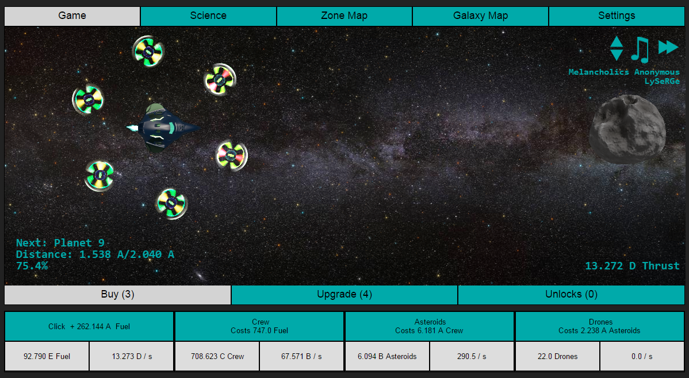

# Infinity Drive

A space-based idle game built around exploration of the solar system and other star systems in the galaxy.

A more graphical style of browser based idle game is powered through heavy use of the HTML5 canvas element.

Written using HTML, Javascript and CSS. Minimal use of general libraries including jQuery etc... favouring minimalistic tailored libraries.

###[Play the Game](http://dpekkle.github.io/infinitydrive/) 
Hosted on Github pages.

####Authors
- Danielle Cerisier
- Graphics by Eris Rudkin
